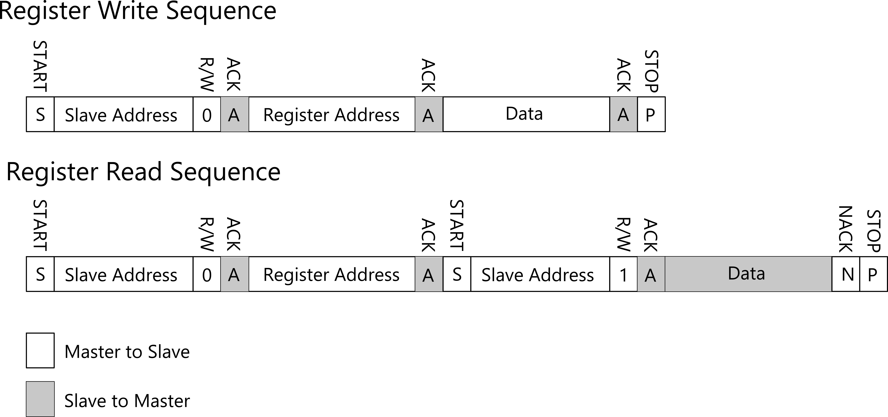

# NixPiZero Firmware

# Interface
NixPiZero Shield behave a I2C slave device.
* Protocol : I2C
* Data length : 8bit
* Stop bit : 1bit
* Slave Address : 0x12 (0b0010010)

# Register Read/Write

# Register Map

| No. | Address | Name | Description | Default Value | R/W |
| ---- | ---- | ---- | ---- | ---- | ---- |
| 1 | 0x01 | STATUS | Display Status | 0 | R/W |
| 2 | 0x11 | Digit1 | Digit1 display number | 0 | R/W |
| 3 | 0x12 | Digit2 | Digit2 display number | 0 | R/W |
| 4 | 0x13 | Digit3 | Digit3 display number | 0 | R/W |
| 5 | 0x14 | Digit4 | Digit4 display number | 0 | R/W |

## STATUS

| Address | Name | B7 | B6 | B5 | B4 | B3 | B2 |B1 | B0 |
| ---- | ---- |---- | ---- | ---- | ---- | ---- | ---- | ---- | ---- |
| 0x01 | STATUS | - | - | - | - | - | REFRESH | FADE | HV |

### HV
When HV bit is set to 1, High-Voltage circuit will turn on.

### FADE
When FADE bit is set to 1, the cross-fade is enabled. 

### REFRESH
When REFRESH bits is set to 1, Nixie-tube display will chanege numbers.  

## Digit1:4

| Address | Name | B7 | B6 | B5 | B4 | B3 : B0 |
| ---- | ---- |---- | ---- | ---- | ---- | ---- |
| 0x01 | STATUS | - |-|-|-| DISP_NUM3:0 |

Digit1-4 is display number of the nixie-tube display. Note that you must set REFRESH bit to 1 after set the number to Digit1:4.